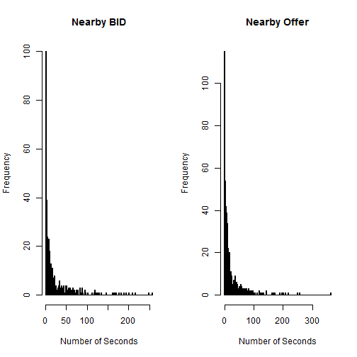
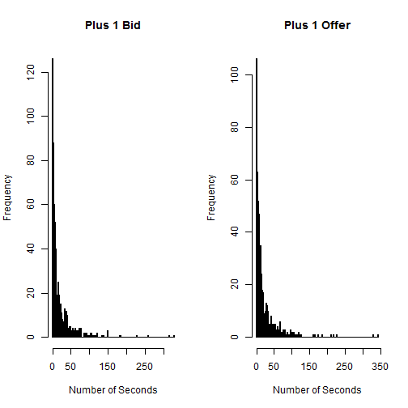
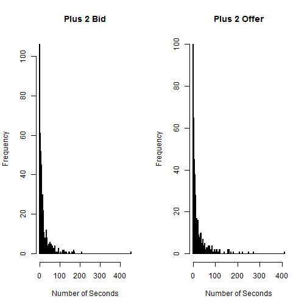
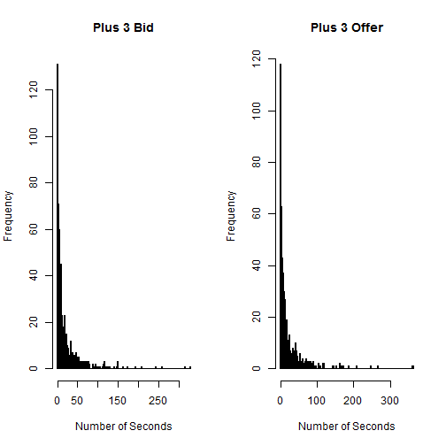
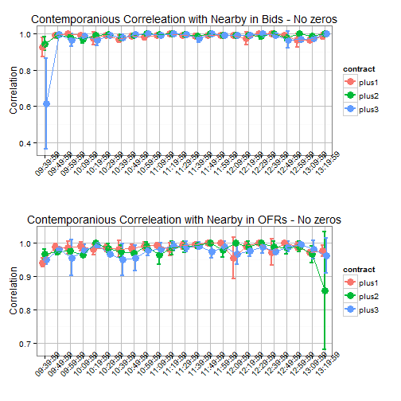
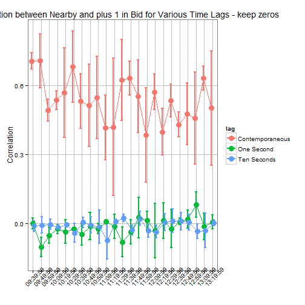

Nearby and Deferred Quotes: What They Tell Us about HFT
========================================================
author: 
date: 07 April, 2015
transition: none


Best Bid and Offer Data set from CME Group
========================================================

So far only processed data for corn

- 2010-2011 is almost finished
- Will begin 2008-2009 when that is finished
- Hopefully that will be finished before NCCC 134, but it takes 2-3 weeks to do the initial
processing for 2 years worth of data

Best Bid and Offer Data set from CME Group
========================================================
- 2008-2013 should be processed and ready to include in the paper which is due in June
- As you recall from Xiaoyang, I still have to modify the pre-processing code to deal with the format change. 
  + I cannot finish this before NCCC134 but it should be fine for the June paper deadline
- These preliminary results are from January 2010 just as an example. Dates:

```
[1] 100104
```

```
[1] 100106
```


A Few Notes About the Data
========================================================
- Many instances include multiple quote revisions on the same time stamp
- Since they are not time stamped to the millisecond, we had to aggregate to the second
- 'last' quote prevailing in the second taken as the top of the book for that second

Objectives of This Study
========================================================
- Learn what we can from the BBO data about the activities of HFT in the
corn futures market
- Make explicit what we would like to learn about HFT but are restricted by content of the Data
  + Encourage CME Group to develop research data sets like the NASDAQ HF Trader data set

Number of Seconds to a Revision in Bid/Ask
========================================================
 

Number of Seconds to a Revision in Bid/Ask
========================================================
 
Number of Seconds to a Revision in Bid/Ask
========================================================
 

Number of Seconds to a Revision in Bid/Ask
========================================================
 

Contemporaneous Correlation of Quotes in the Nearby and Deferred Contracts
========================================================
- Since we had to aggregate to the second, we might expect the quotes to be 
contemporaneously correlated
- Calculated correlations for log changes of Nearby and:
  + One contract deferred
  + Two contracts deferred
  + Three contracts deferred
- Need to consider the effect of long periods of no revisions on the correlations
  + Both presented 
  
Contemporaneous Correlation
========================================================


Contemporaneous Correlation II
========================================================
 

Time Lag
========================================================
 


Proposed Paper Outline
========================================================

Objectives
========================================================
What we would like to study: Whether predatory hft exists in corn futures markets
- Obstacles with the BBO data: 
  + No ms timestamp 
  + Traders not identified: Hasbrouck's 'Strategic Runs' not possible

Objectives
========================================================
- Instead we look for what evidence we can find of hft
  + Keep data as dissaggregated as possible
  + Means any kind of regression analysis is impossible

Motivation
========================================================
- Criticism of hft papers on equities markets is that papers often use data from only one exchange
- Given that U.S. equity markets are highly fragmented, examining trade on only one exchange is bound to give a biased or, at least, incomplete picture. 
- Commodity futures markets are centralized, so we can examine quoting patterns and relationships along the forward curve to get a sense of the prevalence of hft.

Methods
=========================================================
Data Preparation
- Create 'Top of the Book" for the nearby contract and the one, two, and three contracts deferred
- Aggregate to the second
  + Since data not time stamped to the ms the only other option is to simulate the ms time stamp and Hasbrouck and Wang did.  
  + But, since we are examining relationships across markets, one would hope your simulated time stamps would preserve the order in which quotes arrived accross different markets. Impossible
   
Methods
=========================================================
Analysis
- Compute simple correlations between the nearby contract and the one, two, and three month deferred contracts in ten minute time bins
 + Since data are aggregated to the second, one would expect the presence of hft to imply significant contemporaneous correlation between the nearby and the deferred contracts
 + Additionally, since the time intervals of importance to hft are so short, one would expect the correlation between the nearby and deferred contracts lagged even one second to be small
 
Methods
===========================================================
Analysis
- Consider various special cases such as USDA announcement days
- Monthy?
- Day of week?
 
 


  
  
  
  
  


  
  


