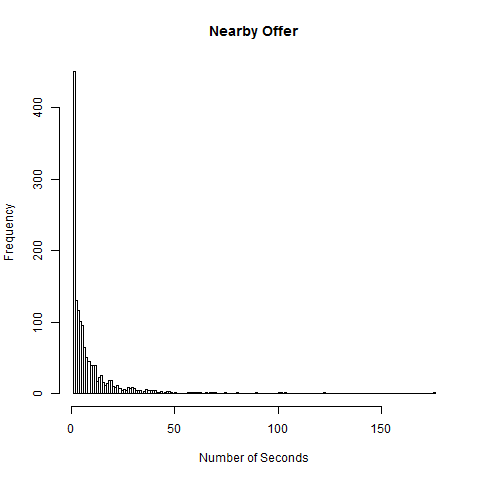

Nearby and Deferred Quotes: What They Tell Us about HFT
========================================================
author: Mindy Mallory, Phil Garcia, and Teresa Serra
date: April 20, 2015
transition: none
University of Illinois  
   
NCCC 134 Applied Commodity Price Analysis, Forecasting, and Market Risk Management

Objectives
========================================================
Identify patterns of correlation in the best bid/offer of the nearby and deferred contracts
- When information arrives to the marketplace it is relevant to the entire forward curve
- But we have little understanding of how quickly and efficiently information is incorporated along the forward curve

Objectives
========================================================
Identify patterns of correlation in the best bid/offer of the nearby and deferred contracts
- Contemporaneous Correlations
 + Bid-to-Bid
 + Ask-to-Ask
 + Bid-to-Ask
 + Ask-to-Bid  

- Time Lagged Correleation
 + Bid-to-Bid
 + Ask-to-Ask
 + Bid-to-Ask
 + Ask-to-Bid

Objectives
========================================================
Identify patterns of correlation in the best bid/offer of the nearby and deferred contracts
- Learn something about the effect of spread trading and high frequency trade on futures markets 
- ... But we will not be able to identify these effects separately
 + Compare quoting frequency in futures with the quoting frequency reported in equities to get some sense of whether correlations are driven by spread trading or hft

Motivation
========================================================
incremental: true
Large and developing literature in finance on the effects of hft on equity markets
- These papers almost unanimously conclude that hft improves markets: information transmission, liquidity, volatility
- But they all suffer similar criticism from thier critics
 + (1) Use datasets that do not identify hft trades, (2) only include trades routed to one exchange, or both

A trader identified dataset does not exist for futures markets, but we do benefit from having centralized markets. We see ALL trades in a given commodity for ALL the contracts in the forward curve

Contributions
========================================================
incremental: true
1. Provide evidence (or lack thereof) on the presence of 'quote stuffing' by comparing the frequency of of quoting in futures with the frequency of quoting in equities, where it is known to occur.
2. Measure the correlation between nearby and deferred contracts, which is suggestive of efficiency in the transfer of information. Brought about by hft, spread trading, or both.
3. Explore whether either of these outcomes are different on USDA report days.

Methods
========================================================
Data
- Corn BBO data set from CME Group 
- More details here.

Methods
========================================================
Data Preparation
- Create 'Top of the Book" for the nearby contract and the one, two, and three contracts deferred
- Aggregate to the second
  + Since data not time stamped to the ms the only other option is to simulate the ms time stamp and Hasbrouck and Wang did.  
  + But, since we are examining relationships across markets, one would hope your simulated time stamps would preserve the order in which quotes arrived accross different markets. Impossible
  
Methods
=========================================================
incremental: true
Analysis

1. Compute quotes per second
2. Compute seconds to next revision
3. Compute simple correlations between the nearby contract and the one, two, and three month deferred contracts in ten minute time bins
 + Since data are aggregated to the second, one would expect the presence of hft and/or spread trading to imply significant contemporaneous correlation between the nearby and the deferred contracts
 + Additionally, since the time intervals of importance to hft are so short, one would expect the correlation between the nearby and deferred contracts lagged even one second to be small
 
Methods
===========================================================
Analysis
- Consider various special cases such as USDA announcement days
- Monthy?
- Day of week?

Number of Seconds to a Revision in Bid/Ask
========================================================

***

Number of Seconds to a Revision in Bid/Ask
========================================================

***

Number of Seconds to a Revision in Bid/Ask
========================================================

***

Number of Seconds to a Revision in Bid/Ask
========================================================

***

Contemporaneous Correlation of Quotes in the Nearby and Deferred Contracts
========================================================
incremental: true
- Since we had to aggregate to the second, we might expect the quotes to be 
contemporaneously correlated
- Calculated correlations for log changes of Nearby and:
  + One contract deferred
  + Two contracts deferred
  + Three contracts deferred
- Need to consider the effect of long periods of no revisions on the correlations
  + Both presented 
  
Contemporaneous Correlation
========================================================

Contemporaneous Correlation II
========================================================

Contemporaneous Correlation II
========================================================

Time Lag
========================================================

Time Lag
========================================================

