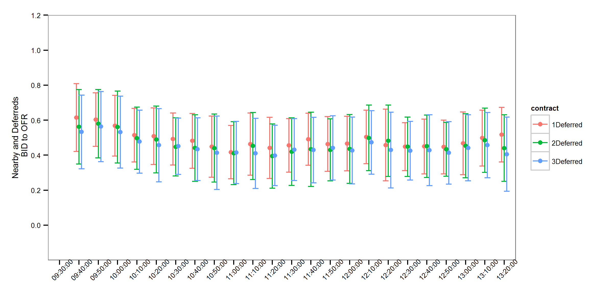
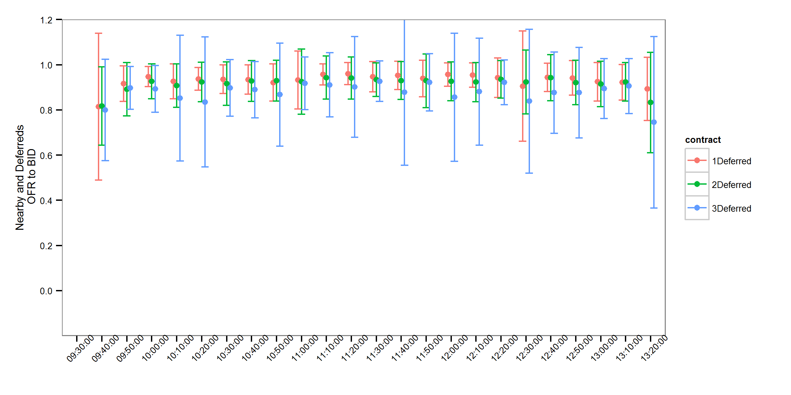
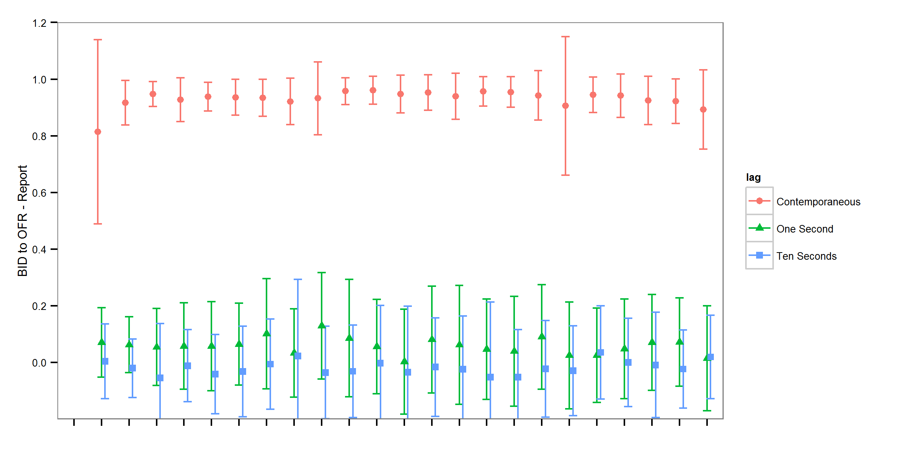

---
output:
  pdf_document:
    fig_caption: yes
    number_sections: yes
geometry: margin=1.25in
csl: american-journal-of-agricultural-economics.csl.txt
bibliography: bbobas.bib
---


```{r, echo=FALSE}
#setwd("C:/Users/mallorym/Documents/GitHub/BBOBAS")
#setwd("C:/Users/mallorym/Documents/BBOBAS")
load('p_values.Rda')
```


|                    |  ID  |SYMBOL|OFRSIZ| OFR   |BIDSIZ| BID   |
|-------------------:|:-----:|:----:|:-----:|:-----:|:-----:|:-----:|
|  2010-01-04 09:30:00|  98790| 1003| 1475| 423.75| 1188| 423.75|
|  2010-01-04 09:30:00|  98800| 1003| 1483| 423.75| 1188| 423.75|
|  2010-01-04 09:30:00|  98810| 1003| 1483| 423.75| 1197| 423.75|
|  2010-01-04 09:30:00|  98820| 1003| 1486| 423.75| 1197| 423.75|
|  2010-01-04 09:30:00|  98830| 1003| 1486| 423.75| 1231| 423.75|
|  2010-01-04 09:30:00|  98840|1003|  1494|423.75|  1231|423.75|
|  2010-01-04 09:30:00|  98850| 1003| 1496| 423.75| 1231| 423.75|
|  2010-01-04 09:30:00|  98860| 1003| 1510| 423.75| 1231| 423.75|
|  2010-01-04 09:30:00|  98870| 1003| 1510| 423.75| 1233| 423.75|
|  2010-01-04 09:30:00|  98880| 1003| 1520| 423.75| 1234| 423.75|

: First ten entries in our data set.

Notes: ID = CME's trade sequence number, Symbol = Contract expiration year (2010) and month (March), OFRSIZ = Number of contracts at the best offered price, OFR = Best price offered (cents per bushel), BIDSIZ = Number of contracts at the best bid price, BID = Best price bid (cents per bushel).

\clearpage

<!--  
This is a table of p-values on the differences in the order of near, 1st, and 2nd deferred. But, we no longer show the contemporaneous-keep-zeros
case, so motivating this table doesn't seem to make sense. 
```{r, echo=FALSE, results="asis", warning=FALSE, messages=FALSE}
library(knitr)
library(xtable)
#kTable(p_values, format = 'markdown')
#kTable(p_values)
t <- xtable(p_values, caption = "P-Values from Welch two-sample t-tests on differences in correlation means displayed in figure 1")
print.xtable(t, caption.placement = 'top', comment=FALSE )
```

Notes: H0: Equal means, H1: Unequal means. 'Near & 1' stands for the correlations between returns of the nearby quotes and returns of the first deferred quotes, 'Near & 2' stands for the correlations between returns of the nearby quotes and returns of the second deferred quotes, and 'Near & 3' stands for the correlations between returns of the nearby quotes and returns of the third deferred quotes. The columns labeled with the convention Near & 1 - Near & 2 contain p-values of a Welch two-sample t-test on differences in the means displayed in figure 2. 
-->


\begin{table*}[h]\centering
\caption{Correlations Calculated to Produce Figures 1, 2, and 3 }
\begin{tabular}{@{}cc|cc|cc@{}}
 \specialrule{1pt}{1pt}{1pt}
 \multicolumn{2}{c|}{Figure 2}                    & \multicolumn{2}{c|}{Figure 3}         & \multicolumn{2}{c}{Figure 4}      \\
 \multicolumn{2}{c|}{No Time Lag}           &\multicolumn{2}{c|}{Time Lag}               &\multicolumn{2}{c}{Time Lag}             \\
\multicolumn{2}{c|}{Correlation of Nearby and}           &\multicolumn{2}{c|}{Correlation of Nearby and 1 deffered}               &\multicolumn{2}{c}{Correlation of Nearby and 1 deffered}             \\

\hline
 Bid to Bid          & 1 deffered& Bid to Bid   & no time lag      & Bid to Offer & no time lag            \\
                     &2 deffered &              &1 second          &              &1 second          \\
                     &3 deffered &              &10 seconds        &              &10 seconds        \\
 Offer to Offer      & 1 deffered& Offer to Offer&  no time lag    &Offer to Bid  &  no time lag                \\
                     &2 deffered &              &1 second          &              &1 second          \\
                     &3 deffered &              &10 seconds        &              &10 seconds        \\
 Bid to Bid          &1 deffered & Bid to Bid   &  no time lag     & Bid to Offer & no time lag                 \\
 (Report)            &2 deffered &  (Report)    &1 second          & (Report)     &1 second          \\
                     &3 deffered &              &10 seconds        &              &10 seconds        \\
 Offer to Offer      & 1 deffered&Offer to Offer& no time lag      &Offer to Bid  & no time lag                  \\
 (Report)            &2 deffered &  (Report)     &1 second          & (Report)     &1 second          \\
                     &3 deffered &              &10 seconds        &              &10 seconds        \\
 \specialrule{1pt}{1pt}{1pt}
\end{tabular}
\end{table*}

     
Notes: This table contains a summary of the correlation results that are presented in figures 1, 2, and 3. Correlations are calculated in for ten minute intervals and for every day of our sample. 

\clearpage


```{r, echo=FALSE, warning=FALSE, fig.height= 6.5, fig.width=6.5, fig.cap = "Price Levels, Number of Ask Quotes, Number of Bid Quotes, and Number of Transactions"}
library(ggplot2)
library(gridExtra)
library(data.table)
library(grid)
load('~/GitHub/BBOBAS/SummaryDT.Rda')
#DT[Deferreds %in% "Nearby"]

numasksplot <- ggplot(DT[Deferreds == "Nearby" & variable == "NumberofAsks"], aes(TradeDate, value, colour=Deferreds, group=Deferreds)) +
  geom_point(size =  1, aes(shape = Deferreds)) +
  scale_colour_grey() +
  #geom_smooth() +
  scale_size_area() +
  ylab("Number of Ask Quotes") +
  theme_bw(base_size = 8) +
  theme(axis.text.x=element_blank(), axis.title.x=element_blank(),
        plot.margin = unit(c(0,1,0,1), "lines"),
        panel.background = element_rect(fill = 'white'), 
        panel.grid.major = element_line(colour = 'white'),
        panel.grid.minor = element_line(colour = 'white'),
        legend.position = "none") 


numbidsplot <- ggplot(DT[Deferreds == "Nearby" & variable == "NumberofBids"], aes(TradeDate, value, colour=Deferreds, group=Deferreds)) +
  geom_point(size =  1, aes(shape = Deferreds)) +
  scale_colour_grey() +
  #geom_smooth() +
  scale_size_area() +
  ylab("Number of Bid Quotes") +
  theme_bw(base_size = 8) +
  theme(axis.text.x=element_blank(), axis.title.x=element_blank(), 
        plot.margin = unit(c(0, 1, 0, 1), "lines"),
        panel.background = element_rect(fill = 'white'), 
        panel.grid.major = element_line(colour = 'white'),
        panel.grid.minor = element_line(colour = 'white'),
        legend.position = "none") 

numtransplot <- ggplot(DT[Deferreds == "Nearby" & variable == "NumberofTransactions"], aes(TradeDate, value, colour=Deferreds, group=Deferreds)) +
  geom_point(size =  1, aes(shape = Deferreds)) +
  scale_colour_grey() +
  #geom_smooth() +
  scale_size_area() +
  ylab("Number of Transactions") +
  theme_bw(base_size = 8) +
  theme(axis.text.x=element_text(), axis.title.x=element_blank(),
        plot.margin = unit(c(0, 1, 0, 1), "lines"),
        panel.background = element_rect(fill = 'white'), 
        panel.grid.major = element_line(colour = 'white'),
        panel.grid.minor = element_line(colour = 'white'),
        legend.position = "none") 

dailyaveprice <- ggplot(DT[Deferreds == "Nearby" & variable == "PriceTransaction"], aes(TradeDate, value, colour=Deferreds, group=Deferreds)) +
  geom_point(size =  1, aes(shape = Deferreds)) +
  scale_colour_grey() +
  #geom_smooth() +
  scale_size_area() +
  ylab("Price (cents/bu") +
  theme_bw(base_size = 8) +
  theme(axis.text.x=element_blank(), axis.title.x=element_blank(),
        plot.margin = unit(c(0, 1, 0, 1), "lines"),
        panel.background = element_rect(fill = 'white'), 
        panel.grid.major = element_line(colour = 'white'),
        panel.grid.minor = element_line(colour = 'white'),
        legend.position = "none") 

# Convert to gtable to align the verticel axis with grid.arrange

dailyaveprice             <- ggplot_gtable(ggplot_build(dailyaveprice))
numasksplot               <- ggplot_gtable(ggplot_build(numasksplot))
numbidsplot               <- ggplot_gtable(ggplot_build(numbidsplot))
numtransplot              <- ggplot_gtable(ggplot_build(numtransplot))

maxWidth                  <- unit.pmax(dailyaveprice$widths[2:3], numasksplot$widths[2:3], numasksplot$widths[2:3], numasksplot$widths[2:3])

dailyaveprice$widths[2:3] <- maxWidth
numasksplot$widths[2:3]   <- maxWidth
numasksplot$widths[2:3]   <- maxWidth
numasksplot$widths[2:3]   <- maxWidth


grid.arrange(dailyaveprice, numasksplot, numbidsplot, numtransplot, ncol=1, heights=c(2.6,2.6,2.6,2.7), widths=6.5)

```

Figure displays data for the corn futures market from 1/14/2008 to 11/04/2011 for the nearby contract. The September contract is excluded due to the possibility of 'old crop' and 'new crop' both being delivered on this contract. To form the continuous nearby series contracts are rolled to the next contract on the 20th of the month prior to the delivery month. 


\clearpage

```{r, echo=FALSE, warning=FALSE, fig.height= 6.5, fig.width=6.5, fig.cap = "Contemporaneous Correlation between Revisions to Quotes in Nearby and Deferred Contracts"}
library(ggplot2)
library(gridExtra)
library(data.table)
library(grid)
load('~/GitHub/BBOBAS/figs_list_full.Rda')
load('~/GitHub/BBOBAS/figs_list_Report.Rda')

grid.arrange(figs_list_full[[1]], figs_list_full[[2]], figs_list_Report[[1]], figs_list_Report[[2]], ncol=1, heights=c(3,3,3,3.2), widths=6.5)

```

Mean correlations and one standard deviation error bars over all days in the top two plots. Mean correlations and one standard deviation error bars in the bottom two plots. 

\clearpage

```{r, echo=FALSE, warning=FALSE, fig.height= 6.5, fig.width=6.5, fig.cap = "Time-Lagged Correlation between Revisions to Quotes in Nearby and 1 Deferred Contracts"}
library(ggplot2)
library(gridExtra)
library(data.table)
library(grid)
load('~/GitHub/BBOBAS/figs_list_full.Rda')
load('~/GitHub/BBOBAS/figs_list_Report.Rda')

grid.arrange(figs_list_full[[3]], figs_list_full[[4]], figs_list_Report[[3]], figs_list_Report[[4]], ncol=1, heights=c(2.6,2.6,2.6,2.7), widths=6.5)

```

Mean correlations and one standard deviation error bars over all days in the top two plots. Mean correlations and one standard deviation error bars in the bottom two plots. 


\clearpage


```{r, echo=FALSE, warning=FALSE, fig.height= 6.5, fig.width=6.5, fig.cap = "Time-Lagged Correlation between Revisions to Quotes (Bid-to-Ask & Ask-to-Bid) in Nearby and 1 Deferred Contracts"}
library(ggplot2)
library(gridExtra)
library(data.table)
library(grid)
load('~/GitHub/BBOBAS/figs_list_full.Rda')
load('~/GitHub/BBOBAS/figs_list_Report.Rda')

grid.arrange(figs_list_full[[5]], figs_list_full[[6]], figs_list_Report[[5]], figs_list_Report[[6]], ncol=1, heights=c(2.6,2.6,2.6,2.7), widths=6.5)

```

Mean correlations and one standard deviation error bars over all days in the top two plots. Mean correlations and one standard deviation error bars in the bottom two plots. Bid-to-Offer means revisions to the lagged nearby bid were correlated with the first deferred revisions to the offer, and Offer-to-Bid means revisions to the lagged nearby offer were correlated with the first deferred revisions to the bid. 


<!--


Figure 1. Contemporaneous Correlation with Nearby - Keep Zeros
-->

<!--


Figure 2. Contemporaneous Correlation with Nearby - No Zeros
-->

<!--


Figure 3. Contemporaneous Correlation with Nearby on USDA Report Days - Keep Zeros
-->

<!--


Figure 3. Contemporaneous Correlation with Nearby on USDA Report Days - No Zeros
-->

<!--


Figure 4. Contemporaneous and Time-lagged Correlations between the Nearby and One-deferred Contract
-->

<!--


Figure 5. Contemporaneous and Time-lagged Correlations between the Nearby and One-deferred Contract on USDA Report Days
-->


<!--


Figure 6. Contemporaneous and Time-lagged Correlations between the One-deferred Contract and Nearby (Price discovery in the distant) 
-->
<!---->
<!--

Figure 7. Contemporaneous Correlations with Nearby Bid-to-Ask and Ask-to-Bid - Keep Zeros
-->
<!--


Figure 8. Contemporaneous and Time-lagged Correlations with Nearby Bid-to-Ask and Ask-to-Bid - No Zeros
-->