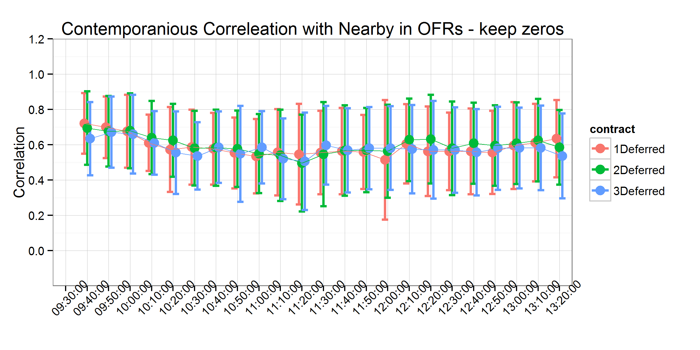
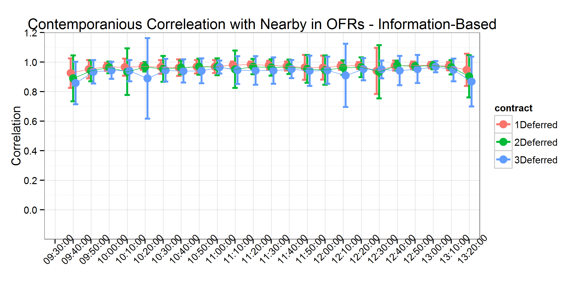

```{r, echo=FALSE}
setwd("C:/Users/mallorym/Documents/GitHub/BBOBAS")
#setwd("C:/Users/mallorym/Documents/BBOBAS")
```


# Introduction
Can we make the citations and biliography work [@hasbrouck2006empirical;@easley2011microstructure]?

# Literature Review

# Data
The data used in this analysis comes from the CME Group's Top of Book (BBO) database for corn futures contracts from 1/4/2010-11/4/2011. The data contains the best bid, bid volume, best offer, offer volume, last trade price, and last trade volume of the order book for each active futures contract, time-stamped to the second. For those familiar with the CME Group's Time & Sales database, the BBO contains the Time & Sales data as well as information about the best bids and offers on the top of the limit order book.  

The data are time-stamped to the second, but trades and updates to the top of the book routinely occur more rapidly than once per second. This results in several updates to the top of the book displaying the same time stamp. This requires us to either aggregate to the second, or to simulate sub-second time stamps (cite Wang and Easley). Since we calculate correlations between updates to the top-of-the book for several maturities, simulation would need to preserve (at least) the order in which updates arrived to each respective contract to be useful. Since preserving the order in which updates to the top of the book is impossible, we aggregate to the second.   

Further, we exclude days on which there was a limit price move, since when prices are locked at the limit, calculating correlations is impossible (1/12/2010 revision to a Crop Production report, 3/31/2011 Prospective Plantings report, 6/30/2011 Planted Acres report,and 10/8/2010 and 12/9/2010). Also, we exclude 4/5/2010, because there was an unusually high numer of revisions to the best bid and best offer. We were not able to process all of the data for this day in a reasonable amount of time, we we drop this day from our sample. Additionally, 7/5/2011 was an unusually light trading day after Fourth of July holiday and resulted in no data for the third to mature contract.

Table 1 shows the first ten entries to our data after manipulating the raw BBO data set from CME Group to display the entire top of the book on one line with the appropriate time stamp. The first column is the time-stamp, the second column is the trade sequence number, which the CME Group gives to individual trades to identify separate orders that arrive on the same second. The third column, SYMBOL, identifies which futures marturity the data is in reference to. In this case, 1003 stands for March 2010, with the first two characters representing the year and the second two characters representing the month. 

Every day, we define the first to mature (nearby), one deferred, two deferred, and three contracts deferred. To avoid undesirable delivery month effects, we roll these definitions at the end of the month prior to contract maturity (For example, on March 1st the May futures contract is considered the nearby, and so forth). 

# Analysis
Our analysis simply considers the correlation of nearby contract bids (offers) with one, two, and three deferred contract bids (offers), respectively. The operating assumption here is that when information arrives to the market, it usually will affect the entire forward curve in the same direction. In other words, information that raises the best bid (lowers the best offer) in the nearby contract, should usually raise the best bid (lower the best offer) in the deferred contracts as well. Linkages between the nearby and deferred contracts can be measured with the simple correlation statistic without making distributional assumptions that may be unfounded given the nature of this high frequency data. Also, comparing contemporaneous correlations with time lagged correlations gives a sence of how quickly information is transmitted up the forward curve. 

We divide the trading day into ten minute intervals and calculate correlations between the nearby and the deferred contract bids (offers) for each ten minute interval with one day's worth of data. This allows us to detect if there are any patterns to these correlations accross the trading day, and since we one correlation per day per ten minute interval, we recover a distribution of correlations for each interval.  

We also separate out days on which major USDA reports are released and calculate the same correlations on these days whick often confer significnat information to the markets that results in significant price moves. During our sample period, the USDA reports we include were released at 8:30 am CST, before the day trading session began. 

# Results


## Contemporaneous Correlation


## Contemporaneous Correlation on USDA Report Days


## Contemporaneous and Time-lagged Correlations


## Contemporaneous and Time-lagged Correlations on USDA Report Days


## Spread Traders?


# Conclusions

# Tables

|                    |  EX   |SYMBOL|	OFRSIZ|	OFR   |	BIDSIZ|	BID   |
|-------------------:|:-----:|:----:|:-----:|:-----:|:-----:|:-----:|
|	2010-01-04 09:30:00|	98790|	1003|	  1475|	423.75|	  1188|	423.75|
|	2010-01-04 09:30:00|	98800|	1003|	  1483|	423.75|	  1188|	423.75|
|	2010-01-04 09:30:00|	98810|	1003|	  1483|	423.75|	  1197|	423.75|
|	2010-01-04 09:30:00|	98820|	1003|	  1486|	423.75|	  1197|	423.75|
|	2010-01-04 09:30:00|	98830|	1003|	  1486|	423.75|	  1231|	423.75|
|	2010-01-04 09:30:00|  98840|	1003|	  1494|	423.75|	  1231|	423.75|
|	2010-01-04 09:30:00|	98850|	1003|	  1496|	423.75|	  1231|	423.75|
|	2010-01-04 09:30:00|	98860|	1003|	  1510|	423.75|	  1231|	423.75|
|	2010-01-04 09:30:00|	98870|	1003|	  1510|	423.75|	  1233|	423.75|
|	2010-01-04 09:30:00|	98880|	1003|	  1520|	423.75|	  1234|	423.75|

: Table 1: First ten entries in our data set. 

# Figures 








# References