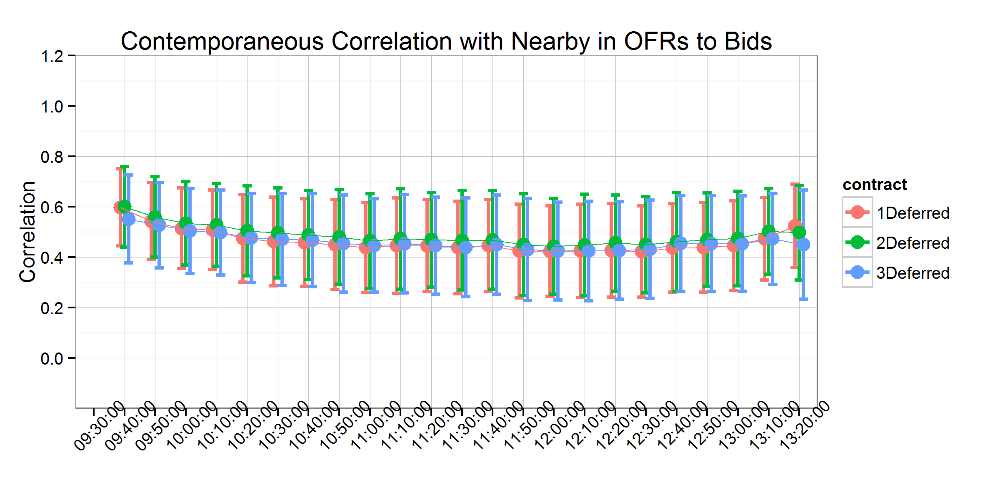

```{r, echo=FALSE}
setwd("C:/Users/mallorym/Documents/GitHub/BBOBAS")
#setwd("C:/Users/mallorym/Documents/BBOBAS")
```


# Introduction
Can we make the citations and biliography work [@hasbrouck2006empirical;@easley2011microstructure]?

# Background
The literature on how information affects liquidity in securities markets is long and rich. @bagehot1971only is regarded as the first to demonstrate that the BAS arises even if inventory and transactions costs are assumed to be zero when asymmetric information is present. @copeland1983information built upon Bagehot's work by assuming that the proportion of informed traders in the market was $\pi$. Knowing this the market maker adjusts his quoted bids and offers to maximize expected profit. Copeland and Galai's model, however, did not account for the fact that the trades themselves could reveal information about whether or not traders were informed. @glosten1985bid formalized this concept and developed a model where the market maker adjusts his beliefs based on the trades that occur. The market maker knows that at least some of the traders are informed so sell orders revise the market maker's belief about the value of the security down and buy orders revise his belief upward. They show that the spread is increasing in the proportion of informed traders, and there is a point at which to many informed traders would require the market maker to set the spread so wide that trade does not occur and the market halts (an example of the famous "Market for Lemons" described by @akerlof1970market).     

@easley2002information incorporate trade size and its effect to a model similar to Glosten and Milgrom
@o1995market provides an excellent summary of this evolution. 

# Conceptual Framework
The role of liquidity trades verses information based trades.

# Data
The data used in this analysis comes from the CME Group's Top of Book (BBO) database for corn futures contracts from 1/4/2010-11/4/2011. The data contains the best bid, bid volume, best offer, offer volume, last trade price, and last trade volume of the order book for each active futures contract, time-stamped to the second. For those familiar with the CME Group's Time & Sales database, the BBO contains the Time & Sales data as well as information about the best bids and offers on the top of the limit order book.  

The data are time-stamped to the second, but trades and updates to the top of the book routinely occur more rapidly than once per second. This results in several updates to the top of the book displaying the same time stamp. This requires us to either aggregate to the second, or to simulate sub-second time stamps (cite Wang and Easley). Since we calculate correlations between updates to the top-of-the book for several contract maturities, simulation would need to preserve (at least) the order in which updates arrived to each respective contract to be useful. Since preserving the order in which updates to the top of the book is impossible, we aggregate to the second instead.   

Further, we exclude days on which there was a limit price move in any of the contracts, since when prices are locked at the limit, calculating correlations is impossible (Dates deleted due to limit price moves are as follows: 1/12/2010, revision to a Crop Production report; 3/31/2011, Prospective Plantings report; 6/30/2011, Planted Acres report; 10/8/2010, World Agricultural Supply and Demand Estimates (WASDE); and 12/9/2010, WASDE). Also, we exclude 4/5/2010, because there was an unusually high number of revisions to the best bid and best offer. Since we were not able to process all of the data for this day in a reasonable amount of computing time, we drop this day from our sample. Additionally, 7/5/2011 was an unusually light trading day after the Fourth of July holiday and resulted in no data for the third to mature contract.

Table 1 shows the first ten entries to our data after manipulating the raw BBO data set from CME Group to display the entire top of the book on one line with the appropriate time stamp. The first column is the time-stamp, the second column is the trade sequence number, which the CME Group gives to individual trades to identify separate orders that arrive on the same second. The third column, SYMBOL, identifies which futures maturity the observation represents. In this case, 1003 stands for March 2010, with the first two characters representing the year and the second two characters representing the month. 

For each date in our sample, we define the first to mature (nearby), one, two, and three contracts deferred. To avoid undesirable delivery month effects, we roll these definitions at the end of the month prior to contract maturity (For example, on March 1st the May futures contract is considered the nearby as opposed to the March futures contract, and so forth). 

# Analysis
Our analysis simply considers the correlation of revisions to nearby contract bids (offers) with one, two, and three deferred contract bids (offers), respectively. The operating assumption here is that when information arrives to the market, it usually will affect the entire forward curve in the same direction. In other words, information that raises the best bid (offer) in the nearby contract, should usually raise the best bid (offer) in the deferred contracts as well. Linkages between the nearby and deferred contracts can be measured with simple correlations without making the distributional assumptions required by a more intricate econometric model. Given the high frequency and irregularly spaced nature of the data, such distributional assumptions are often problematic (cite). 

We have two primary objectives in this study: 1) calculate the strength of correlations between the order books of the nearby and deferred contracts, and 2) measure (or bound) the time it takes for information to be transmitted from nearby to deferred contracts. To measure the first, we calculate contemporaneous correlations between the log changes of the bid (offer) in the nearby and the deferred contracts. Then, to measure the second we calculate the correlation between time lagged log changes of the bid (offer) of the nearby with log changes of the bid of the deferred contracts. We lag the nearby by one second and ten seconds. The time lagged correlations provide a measure of how long it takes for information to be transmitted from nearby to the deferred contracts. The logic is that if we observe contemporaneous correlation between the nearby and deferred contracts, we can search for the time lag at which we observe the correlation disappearing. We conclude that information has been fully transmitted when the time lagged nearby and deferred contract order book revisions become uncorrelated.  

Since the corn futures contract experiences non-uniform trading volume throughout the day, there may be time of day effects in the strength and rate at which information is transmitted through the futures market. To measure how the correlations change throughout the trading day, we divide the day into ten minute intervals and calculate correlations between the nearby and the deferred contract bids (offers) for each interval with one day's worth of data. This allows us to detect if there are any discernible patterns to the correlations over the trading day. Further, since we calculate one correlation per day we also recover a whole distribution of the correlations for each time interval.  

## USDA Announcement Days
On USDA report announcement days there is often a significant amount of information that market participants receive at the same time, causing large price fluctuations and larger than usual trading volumes. Therefore, in our analysis we also separate out days on which major USDA reports are released and calculate the same correlations described above. During our sample period, the USDA reports we include were released at 8:30 am CST, before the day trading session began.

## Treatment of Zero Changes
We mentioned above that it is common to have multiple revisions to the order book happen in the same second (and consequently receive the same time-stamp in the data). The converse is also true, however. There are also many instances where a number of seconds will transpire before a revision to the top of the order book arrives. This results in our variables, log changes in best bid (offer), containing many zeros. How these zeros are distributed between the contracts is related to the concepts of liquidity-based activity verses information-based activity discussed in the conceptual framework above.

To fix ideas consider the case where we intend to calculate the contemporaneous correlation between the nearby and the deferred contracts. There are four possibilities for the presence of zeros. On any time stamp one of four situations may be operative: 1) neither the nearby nor the deferred has a zero log change in the bid (offer), 2) either the nearby or the deferred has a zero log change in the bid (offer), but not both, or 3) both the nearby and the deferred have a zero log change in the bid (offer).    

Based on the definition of liquidity-based activity and information-based activity in the conceptual framework from above, we present a case for interpreting (1) as information-based activity, (2) liquidity-based activity, and (3) neither liquidity based activity nor information-based activity.    

The intuition is that if both the nearby and deferred contracts experience a revision in the same direction, they are likely responding to the the arrival of information to the marketplace, and best bids (offers) adjusted accordingly. This in contrast to the case where one of the two contracts experienced a revision and the other contract had no change.  If one contract experienced a revision in the best bid (offer) and the other did not, it is likely that the revision resulted from someone making a liquidity based order in an effort to exit their position.  

If this intuition is correct, it is informative to consider only time-stamps for which both contracts experienced a revision. In the next section we will present results based on all data in our sample and the sub-sample where only the time-stamps for which both contracts experienced a non-zero revision to the top of the book are included as separate cases.  

# Results
In this section we present a series of charts that display the calculations described in the preceding section. First we present all the correlation charts calculated contemporaneously: full sample, liquidity activity only, USDA report days only. Then we present correlation charts calculated at one and ten second time lags of the nearby contract for the full sample, liquidity activity only, and USDA report days only. 

For each set of figures panel A is produced with bid-to-bid correlations and panel B is produced with offer-to-offer correlations of the nearby and deferred maturity contracts. Correlations are calculated over ten minute intervals starting at 9:30am Central Standard Time, the beginning of the daytime trading session for CBOT corn futures. One correlation is is calculated per day per ten minute bin, so for every ten minute bin we recover a distribution of correlations. The dots represent the mean of the distribution and the bars represent one standard deviation.  

## Contemporaneous Correlation
In figure 1 contemporaneous correlation between the nearby and one, two, and three deferred maturity contracts are calculated. Correlations between both the nearby bid and deferred bids in panel A and nearby offers and deferred offers in panel B seem to have fairly stable means beginning around 0.6 at the start of the trading day and falling slightly to around 0.5 as trading progresses. Both means and one standard deviation error bars seem to exhibit a fairly constant and stable relationship over the trading day; there is no trend up or downward in the mean correlations as trading progresses. 

It is interesting that the distribution of correlations between the nearby and deferred contract bids are at such similar levels, hovering between 0.5 and 0.6. Also, the correlation between nearby and two contracts deferred is highest,  nearby and three contracts deferred is next highest, and the nearby and one contract deferred is lowest, across all ten minute intervals. This result is puzzling. We expected either a random ranking among correlations with the different deferreds or that the highest correlations would result from the nearest to mature contracts.  

In panel B, we see a very similar panel after calculating the correlations for offers between the nearby and deferred maturities. 

## Contemporaneous Correlation - Information-Based Activity Only
In figure 2 we see a very different pattern of correlation when we perform the calculations based only on time-stamps where both the nearby and deferred maturity experience non-zero revisions to the best bid (panel A) or offer (panel B). When we focus on what we are calling information-based activity, the correlations between the nearby and deferred best bids (offers) basically go to one. 

This implies that in the event both contracts experience revisions to their respective limit order books, they are revised in lockstep. While some of this correlation is artificially induced due to the tick structure of price changes in this market (prices move in 1/8th of a cent increments.), not all of it can be attributed to that. Additionally, we since our data is only time-stamped to the second, we may be missing nuance that would be captured with data time stamped to the millisecond. However, we contend that the result further supports interpreting this activity as information based, even considering that the market has 1/8th of a cent tick structure and the data is time stamped to the second. 

## Contemporaneous Correlation on USDA Report Days
Figure 3, is exactly analogous to figure 1 in that it calculates the contemporaneous correlation between nearby and deferred bids (panel A) and offers (panel B), keeping data for which zeros are present.  We see a remarkably similar depiction compared to figure 1, in that the correlations hover between 0.5 and 0.6 throughout the trading day. There is visibly more variation in the means of these distributions, resulting from the small sample of report days we average over, but the one standard deviation error bars are similar to that generated by the full sample. 

If there had been a difference in the pattern of correlations on USDA report days, one would have expected the first ten minutes of trading to display the largest effect. Contrary to this, however, there does not seem to be any discernible effect of USDA report releases on the market open, or in any other time bin. Two primary causes are suspected: 1) Since we removed days were the report release corresponded to limit price moves, we systematically removed report days where the most important information was conferred on the market. It is possible that the remaining days corresponded to USDA reports that contained relatively less relevant market information, or they contained information market participants widely expected beforehand. 2) Since USDA reports were released prior to the market open during this time period, the information may have already been fully incorporated by market participants by the time the market opened, resulting in no discernible difference in the pattern of correlations in the first (and subsequent) time bins.    

## Contemporaneous Correlation - USDA Report Days and Information-Based Activity Only

Figure 4 is analogous to figure 2 in that is it generated by calculating the contemporaneous correlation between nearby and deferred bids (panel A) and offers (panel B), removing data where zeros are present.  Again, this figure is very similar to its full sample counterpart, correlations between the nearby and deferred are nearly one throughout the trading day. Like in figure 3, we observe more variation due to the small sample of USDA report days relative to the full sample. 

## Contemporaneous and Time-lagged Correlations

An important contribution of this analysis is to provide a measure of the speed at which information is transmitted from the nearby to the deferred contracts. To measure this, we lag the nearby series of log changes in the bid (offer) and calculate the correlation with the deferred bids (offers). This allows us to determine the length of time it takes for information to be fully transmitted to the deferred contracts. The assumption here is that the length of time it takes for the revisions to the top of the nearby limit order book to become uncorrelated with revisions to the top of the deferred limit order books is the length of time it takes for information to be transmitted between the two markets. 

Figure 5 contains the correlations between the nearby and one deferred contracts. The graph shows the contemporaneous correlation from figure 1 as a reference, and correlations generated by lagging the nearby by one second and ten seconds respectively. Here we expected to see a clear pattern of decreased correlation as we increased the length of the lag in the nearby. However, we see that the correlation drops to zero with a lag of one second, which in this data set is the shortest time lag possible. ^[We generated this figure for USDA report days only. Similar to our result before, it is basically the same as figure 5 with more variation due to the small sample.] 

There are two possible explanations for this. First, it is possible that there is a clear and decreasing correlation between lags of the nearby and the deferreds, but it can only be observed on mili- or micro-second time stamps. Then, when aggregating to the nearest second, we only observe contemporaneous correlation, but zero correlation even at the shortest possible time delay. 

This would also occur if linkages between the nearby and deferred contracts were immediately enforced by spread traders. Surely the spread trade is an important component that keeps nearby and deferred contracts linked in economically meaningful ways. Spread trading does not really explain this phenomenon, however, because a spread trade is entered as a bid (offer) in the nearby and a offer (bid) in the deferred contract. Until now, we have been measuring correlations bib-to-bid and offer-to-offer between the nearby and deferred contracts.

In figure 6 we generate a figure analogous to figure 1 in that it calculates the contemporaneous correlations between the nearby and deferred revisions to the top of the book. Figure 6, however, calculates the correlation between revisions to the nearby by bid with the deferred offer in panel A, and nearby offer with deferred bid in panel B. Here, as in figure 1 we see correlations hovering between 0.5 and 0.6. Perhaps the only distingishable characteristic of this figure compared to figure 1 is that the unexpected ordering of correlations highest to lowest as 2, 1, and 3 deferred that is present in figure 1 is no longer evident. The correlations of the nearby with the different deferred maturities is noticeably tighter in the bid-to-offer and offer-to-bid correlations.     


# Discussion
Spread traders? High frequency trade?

## A Measure of the Proportion of Market Activity Attributable to Information- verses Liquidity-Based Activity

# Conclusions

# Tables

|                    |  EX   |SYMBOL|	OFRSIZ|	OFR   |	BIDSIZ|	BID   |
|-------------------:|:-----:|:----:|:-----:|:-----:|:-----:|:-----:|
|	2010-01-04 09:30:00|	98790|	1003|	  1475|	423.75|	  1188|	423.75|
|	2010-01-04 09:30:00|	98800|	1003|	  1483|	423.75|	  1188|	423.75|
|	2010-01-04 09:30:00|	98810|	1003|	  1483|	423.75|	  1197|	423.75|
|	2010-01-04 09:30:00|	98820|	1003|	  1486|	423.75|	  1197|	423.75|
|	2010-01-04 09:30:00|	98830|	1003|	  1486|	423.75|	  1231|	423.75|
|	2010-01-04 09:30:00|  98840|	1003|	  1494|	423.75|	  1231|	423.75|
|	2010-01-04 09:30:00|	98850|	1003|	  1496|	423.75|	  1231|	423.75|
|	2010-01-04 09:30:00|	98860|	1003|	  1510|	423.75|	  1231|	423.75|
|	2010-01-04 09:30:00|	98870|	1003|	  1510|	423.75|	  1233|	423.75|
|	2010-01-04 09:30:00|	98880|	1003|	  1520|	423.75|	  1234|	423.75|

: Table 1: First ten entries in our data set. 

# Figures 





# References
