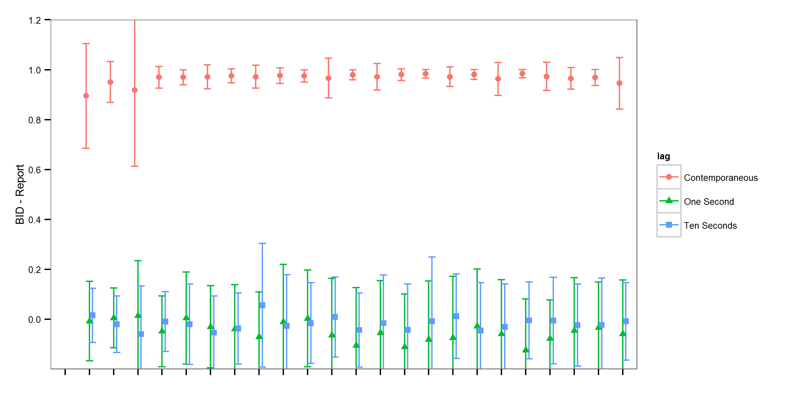

```{r, echo=FALSE}
#setwd("C:/Users/mallorym/Documents/GitHub/BBOBAS")
setwd("C:/Users/mallorym/Documents/BBOBAS")
```


# Introduction

# Literature Review

# Data


# Analysis

# Results

## Contemporaneous Correlation


## Contemporaneous Correlation on USDA Report Days


## Contemporaneous and Time-lagged Correlations




## Contemporaneous and Time-lagged Correlations on USDA Report Days


## Spread Traders?


# Conclusions