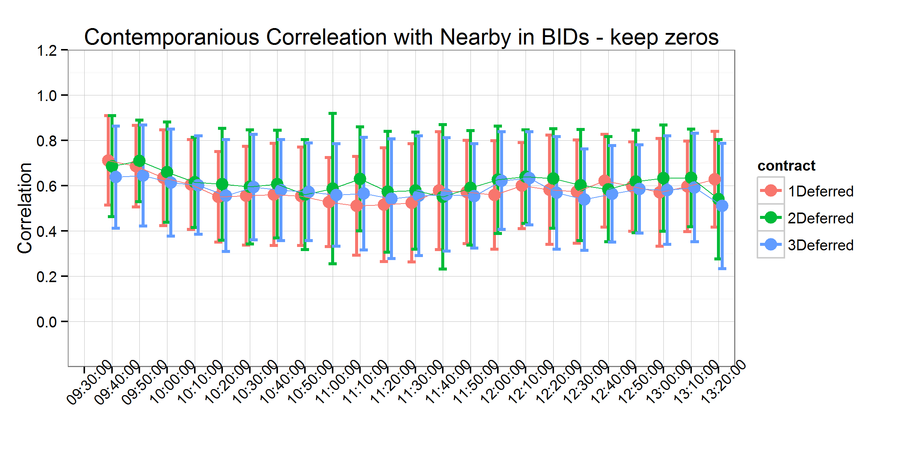

```{r, echo=FALSE}
#setwd("C:/Users/mallorym/Documents/GitHub/BBOBAS")
setwd("C:/Users/mallorym/Documents/BBOBAS")
```


# Introduction
There has been recent concern about whether and how the 'Financialization of Commodity Markets' has impacted market efficiency (futures markets as unbiased predictors of future spot prices) and efficacy in the traditional roles of risk mitigation, coordinating production, and coordinating consumption through time [@Irwin01032011; @NBERw19642; @Irwin2012256; @Henderson01052015]. Further, the recent increase in the production of biofuel from food commodities and volatile crude oil prices have created or changed the relationship between food and energy commodities [@Serra2013141;@Mallory20122157; @Gardebroek2013119;  @Vacha2013233; @Avalos2014253; @trujillo2012volatility]. Additionally, climate change, rising demand for agricultural commodities, and volatile inventories and exchange rates have imposed structural changes in commodity markets [@balcombe2011nature; @gilbert2010food; @prakash2011rising].

These issues represent potentially profound shifts in the way commodity markets operate, and the articles cited above have considered their implications. However, how these changes affect commodity markets tick-by-tick and quote-by-quote needs to be considered. Since global price discovery occurs on global futures exchanges for the major food commodities, a deep consideration of these changes on trading activity, patterns, and consequences is warranted. We use "high frequency data" (time stamped to the second), in order to allow for faster price change adjustments taking place after significant technical developments in trading platforms in the second half of the 2000s, characterized by high speed trading.

Price analysis can be classified into structural and non-structural studies. While structural models rely on economic theory, non-structural analyses identify empirical regularities in the data. The approach throughout this article is non-structural. We employ this approach primarily because there is scant market microstructure literature that was developed with the particular characteristics of commodity futures markets in mind. Our purpose in this article is to develop initial metrics of information- versus liquidity-based activity in commodity markets.

Even how to develop simple metrics of information- versus liquidity-based activity from standard microstructure models is not obvious because standard models of trading securities are not necessarily directly applicable to commodity futures markets. For example, in commodities futures markets several contracts with different maturities trade in the marketplace, each reacting to information and liquidity-based shocks. Each contract reacts differently to information-based shocks because there is a cost to store the physical commodity through time. Therefore, an information based shock that is most pertinent to the nearby contract may have a large effect on the nearby futures contract, but a dampened effect in more distant maturing contracts. For example, information about shortages and surpluses in the near-term are mitigated in distant contracts by the assumption that high (low) prices today will ration (encourage) consumption and therefore mitigate price effects. Further, each contract maturity attracts different levels of liquidity. Generally liquidity decreases as more distant contracts are considered except that commodities produced once per year - corn, for example - are harvested in the fall and the 'new crop contract' with a December maturity routinely attracts more volume than the May or July contract even when the May or July contract expires sooner.

The metrics we develop in this article on liquidity and transmission of information are based on insights we combined from the sequential trading models on single securities, index futures based on a basket of securities, and some of the features of commodity futures markets described in the preceding paragraph. Using the standard sequential trading result that quote revisions only occur if liquidity providers have updated their beliefs about the value of the security after observing order flows, the correlation between quote revisions in nearby and deferred contracts can be used to measure information-based activity, and correlations between revisions of the time lagged nearby and deferred maturity can be used to measure the speed at which information is transmitted among the different futures maturities. This metric is sensible in commodity futures markets but not in a market for a single security because futures markets have multiple maturity contracts that should respond to information in a very similar and predictable way.

We find that within one second information has been fully transmitted from nearby to deferred contract maturities. Without a model explicitly relating these correlations to primitives of a sequential trading model, we cannot interpret much about the size of the correlations or the speed of information transfer, but these facts certainly shed light on how the markets behave recently. Future research would develop a sequential trading model for commodity futures markets where more insights about model primitives could be gleaned.

The remainder of the article is organized as follows. First we provide a background of the sequential trading and index futures microstructure literature and describe the conceptual framework that motivates our interpretation of correlations of quote revisions as a metric of information-based activity. Next we describe the data and report the results of our analysis. Finally, we make some concluding remarks.


# Background
The literature on how information affects liquidity in securities markets is long and rich.^[The interested reader can refer to @o1995market for an excellent and detailed overview of the evolution of this literature.] @bagehot1971only is regarded as the first to demonstrate that a Bid-Ask-Spread (BAS) arises when asymmetric information is present even if inventory and transactions costs are assumed to be zero. @copeland1983information built upon Bagehot's work by assuming that a specific proportion of traders were informed. Knowing this the market maker adjusts his quoted bids and offers to maximize expected profit. Copeland and Galai's model, however, did not account for the fact that the trades themselves could reveal information about whether or not traders were informed. @glosten1985bid formalized this concept and developed a model where the market maker adjusts his beliefs based on the trades that occur. The market maker knows that at least some of the traders are informed so sell orders revise the market maker's belief downward about the value of the security and buy orders revise his belief upward. They show that the spread is increasing in the proportion of informed traders, and there is a point at which too many informed traders require the market maker to set the spread so wide that trade does not occur and the market halts (an example of the famous "Market for Lemons" described by @akerlof1970market).

@easley1987price and @easley1992time incorporate trade size and its effect to a model similar to Glosten and Milgrom. A market maker must set break-even bid and offer quotes knowing that he faces a certain proportion of informed traders who only trade if they receive a signal that an information event has occurred and a certain proportion of uninformed traders who do not receive an information signal but occasionally need to trade for liquidity reasons. Both informed and uninformed traders can choose between a large and small block trading size. This model setup leads to two types of equilibria: a separating equilibrium where informed traders only trade in large quantities and a pooling equilibria where informed traders may trade both large and small quantities.  This model setup of information uncertainty and asymmetric information leads to the market maker updating his beliefs about the value of the security (and therefore his quotes) based on the order flow he observes in the market. For example, in a separating equilibrium a large trading block causes the market maker to revise upward his expectation that an information event has occurred (since informed traders do not transact at small sizes). This results in a trade off for the informed trader. Transact at 'good' price with one large lot, or transact with several small lots at 'good', but worsening, prices as the market maker learns slowly from the informed traders' one sided order flow.

@hasbrouck2006empirical provides and excellent overview of how @easley2002information and @easley1997one use the Easley and O'Hara models of informed trading to develop a measure of the probability of informed trading (PIN). This measure, though, is estimated solely based on the sequence of order arrivals, where a trade is labeled as buyer initiated if the trade occurs above the midpoint of the quoted spread and seller initiated if the trade occurs below the midpoint of the quoted spread. Numerous studies have documented that there may be problems with downward bias in the estimated PIN [@Yan2012454; @Vega2006103; @Boehmer200726] and estimating information based trading in this way ignores some aspects of futures markets discussed above that are not present in securities markets. For these reasons we seek an alternative to the PIN measure of information based trading in commodity futures.

To the best of our knowledge there are no market microstructure models that explicitly take into account the features of commodity futures markets. The closest models come from work on index futures that cover a basket of securities. Most prominent is the work by @kumar1994information who assume *N* different non-dividend paying securities and an index futures contract on a buy-and-hold portfolio of a subset of these stocks. In Kumar and Seppi's model, specialists in the cash market observe a signal, and floor traders of the futures index observe a signal about the value of the index but not the individual securities. A key feature they build into the model is a lag in the information transmittal between the cash and futures markets because specialists only observe order flows from their own market, and not the other. This lag in information transmittal allows for arbitrageurs, who possess faster telecommunication technologies, to learn from transactions in both markets and make profitable trades in the cash and futures markets. In common futures market parlance, these 'arbitrageurs' are analogous to spread traders who trade in both nearby and deferred contracts hoping to profit on relative price movements.

There are some important distinctions between the arbitrageurs as imagined in the Kumar and Seppi model and spread traders in a futures market. Namely, the basis between a composite of cash security prices and the price of a futures index of the same basket should behave in very predictable ways (the basis, in theory, should only vary with interest rates and expected changes in dividend yields if information is symmetric). In contrast, the spread between the price of two commodity futures contracts with different maturities depends on many more uncertain structural variables: domestic and international consumption, exchange rates, production or distribution bottlenecks, and weather among other things. The arbitrageurs in Kumar and Seppi's model need only to wait for others in the marketplace to learn to profit. The futures market spread trader entertains much more risk in betting on relative price changes between two futures maturities.  

However, Kumar and Seppi's model yields two empirical predictions that provide insight. Their Proposition 1 states that it may not be optimal for the arbitrageur to hold a perfectly offsetting position. Because there is a time lag over which the specialists learn about realized market signals in the other market, it may be optimal for the arbitrageur to hold a net long or net short position in the cash or index futures market. As noted above, the commodity futures market is even noisier and so this proposition may hold for commodity futures as well. Next, their proposition two states that the correlation between arbitrageurs' stock and futures orders is negative, meaning if they are long the in the cash basket of securities they are likely to be short the basket of index futures, or vice versa. If arbitrageurs only made perfectly offsetting orders in the cash and futures markets, this would trivially be a perfect negative correlation. What this behavior means for bids, offers, and relative transaction prices in the cash and futures market is unclear because the arbitrageurs' activities could cause the cash and futures prices to come together or cause them to diverge.

In the next section we draw insights from the sequential trading models described above to generate some empirical predictions about the correlations between revisions to bids and offers of nearby and deferred maturity commodity futures contracts.

# Conceptual Framework
In this section we develop a conceptual framework for how the role of liquidity-based activity versus information-based activity should affect quote revisions in a commodity futures market. There is no published formal market microstructure theory of commodity futures markets, but we can use insights from the Easley and O'Hara and Kumar and Seppi models described above, along with features of commodity futures markets to generate some empirical predictions about the correlations between revisions to quotes in the nearby and deferred maturity commodity futures contracts.

First, consider an absence of information. In the Easley and O'Hara sequential trader models, the market maker revises his quotes only when he updates his belief that the value of the security has changed. Therefore, we interpret no changes in revisions to bids (offers) as indicative of no information having arrived to the market. Any transactions that occur at these prices, the market maker believes were conducted by uninformed traders demanding liquidity.

Conversely, when we observe revisions to the bid and offer, we can infer that the market maker from the Easley and O'Hara models has updated his beliefs about information arrival to the market based on past order flows. These revisions to the bid and offer we interpret as indicative of information having arrived to the market.

Now we discuss features of futures markets that we can utilize when considering revisions to nearby and deferred contract quotes. First, in actively traded commodity futures markets there is no market maker, but there are entities who activley supply liquidity to the market under a variety of motives. Since the Easley and O'Hara models consider a competitive market maker, it is irrelevant whether there is one one market maker in the traditional sense or a large number of liquidity providers 'making markets'.  Second, when the market makers revise their beliefs that an information event has arrived to the market, they know it affects futures contracts of all maturities (Similar to Kumar and Seppi, one can think of futures contracts of all maturities as a single factor model cite) so quotes must be revised in all contracts.

This should induce a high degree of correlation between bid and offer revisions when an information event arrives. Further, one market maker would revise bids and offers on futures contracts of all maturities at the same time they updated beliefs about an information event having occurred. As a practical matter with many entities making markets in the futures contracts, it is not clear that this updating will happen in all maturities simultaneously. Therefore, it is of interest to measure correlation contemporaneously and at increasing time lags of the nearby to determine how quickly beliefs are updated in deferred maturities relative to the nearby.

# Data
The data used in this analysis comes from the CME Group's Top of Book (BBO) database for corn futures contracts from XX/XX/2008-11/4/2011. The data contain the best bid, bid volume, best offer, offer volume, last trade price, and last trade volume of the order book for each active futures contract, time-stamped to the second. For those familiar with the CME Group's Time & Sales database, the BBO contains the Time & Sales data as well as information about the best bids and offers on the top of the limit order book.  

The time period examined was characterized by volatility, uncertianty, and rapid increases in prices in the beginning and end of the sample. Prices increased to a peak of approximately $7.50 per bushel in 2008, a time a time which saw a broad class of commodity markets exhibiting similar rapid price increases. Then a relatively stable period from 2009 and 2010 saw prices within a relatively tight range of $3.00 to $4.50 per bushel. In the final year of the sample, uncertainty and rapid price increases reigned again as worries about a smaller than anticipated crop and small ending stocks drove prices to nearly $8.00 per bushel. While prices were volatile, the share of contracts traded on the CME's electronic trading platform, Globex, had already stabilized to nearly 90% by 2008 [@peterson2015]. So any effects we study should not be related trading infrastructure changes that may have occured during the migration of volume to the electronic exchange.

The data are time-stamped to the second, but trades and updates to the top of the book routinely occur more rapidly than once per second. This results in several updates to the top of the book displaying the same time stamp. This requires us to either aggregate to the second, or to simulate sub-second time stamps [@hasbrouck2015;@WangPhd14]. Since we calculate correlations between updates to the top-of-the book for several contract maturities, simulation would need to preserve (at least) the order in which updates arrived to each respective contract to be useful. Since preserving the order in which updates to the top of the book is impossible, instead we aggregate to the second by taking the last recorded state of the top-of-the-book.

Further, we exclude days on which there was a limit price move in any of the contracts, since when prices are locked at the limit, calculating correlations is impossible (Dates deleted due to limit price moves and the corresponding information events, if known, are as follows: 1/12/2010, revision to a Crop Production report; 3/31/2011, Prospective Plantings report; 6/30/2011, Planted Acres report; 10/8/2010, World Agricultural Supply and Demand Estimates (WASDE); and 12/9/2010, WASDE). Also, we exclude 4/5/2010, because there was an unusually high number of revisions to the best bid and best offer. Since we were not able to process all of the data for this day in a reasonable amount of computing time, we drop this day from our sample. Additionally, 7/5/2011 was an unusually light trading day after the Fourth of July holiday and resulted in no data for the third to mature contract.

Table 1 shows the first ten entries to our data after manipulating the raw BBO data set from CME Group to display the entire top of the book on one line with the appropriate time stamp. The first column is the time-stamp, the second column, ID, is the trade sequence number, which the CME Group gives to individual trades to identify separate orders that arrive on the same second. The third column, SYMBOL, identifies which futures maturity the observation represents. In this case, 1003 stands for March 2010, with the first two characters representing the year and the second two characters representing the month. The fourth column, OFRSIZ, is the number of contracts quoted at the best offer price. The fifth column, OFR, is the best offered price. The sixth column, BIDSIZ, is the number of contracts quoted at the best bid price; the last column, BID, is the best bid price.

For each date in our sample, we define the first to mature (nearby), one, two, and three contracts deferred. To avoid undesirable delivery month effects, we roll these definitions at the end of the month prior to contract maturity (For example, on March 1st the May futures contract is considered the nearby as opposed to the March futures contract, and so forth).

# Analysis
Our analysis considers the correlation of revisions to nearby contract bids (offers) with one, two, and three deferred contract bids (offers), respectively. We anticipated in the Conceptual Framework section that when information arrives to the market, it usually will affect the entire forward curve in the same direction. In other words, information that raises the best bid (offer) in the nearby contract, should usually raise the best bid (offer) in the deferred contracts as well. Linkages between the nearby and deferred contracts can be measured with simple correlations without making the distributional assumptions required by a more intricate econometric model. One of the key methodological issues when it comes to assessing high frequency data is the non-normality of price data that complicates proper modeling and requires the use of appropriate methodoligies for appropriate analysis [@ait2005often; @andersen2001distribution; @easley2012volume; @hasbrouck2013high; @lee2008jumps; @lehecka2014gone].

We have two primary objectives in this study: 1) calculate the strength of correlations between the order books of the nearby and deferred contracts, and 2) measure (or bound) the time it takes for information to be transmitted from nearby to deferred contracts. To measure the first, we calculate contemporaneous correlations between the log changes of the bid (offer) in the nearby and the deferred contracts. Then, to measure the second we calculate the correlation between time lagged log changes of the bid (offer) of the nearby with log changes of the bid of the deferred contracts. We lag the nearby by one second and ten seconds. The time lagged correlations provide a measure of how long it takes for information to be transmitted from nearby to the deferred contracts. The logic is that if we observe contemporaneous correlation between the nearby and deferred contracts, we can search for the time lag at which we observe the correlation disappearing. We conclude that information has been fully transmitted when the time lagged nearby and deferred contract order book revisions become uncorrelated. Conversely, we may observe that there is no contemporaneous correlation, but there is lagged correlation.

Since the corn futures contract experiences non-uniform trading volume throughout the day, there may be time of day effects in the strength and rate at which information is transmitted through the futures market. To measure how the correlations change throughout the trading day, we divide the day into ten minute intervals and calculate correlations between the nearby and the deferred contract bids (offers) for each interval. Ten minutes was shown to be long enough for market adjustment to take place in Lehecka [-@lehecka2014gone] This allows us to detect if there are any discernible patterns to the correlations over the trading day. Further, since we calculate one correlation per bin per day we also recover a whole distribution of the correlations for each time interval.  

## USDA Announcement Days
On USDA report announcement days there is often a significant amount of information that market participants receive at the same time, potentially causing large price fluctuations and larger than usual trading volumes [@lehecka2014gone]. Therefore, in our analysis we also separate out days on which major USDA reports are released and calculate the same correlations described above. During our sample period, the USDA reports we include were released at 8:30 am CST, before the day trading session began.

## Treatment of Zero Changes
We mentioned above that it is common to have multiple revisions to the order book on the same second (and consequently receive the same time-stamp in the data). The converse is also true, however. It is also common for a number of seconds to transpire before the top of the order book is revised. This results in our variables, log changes in best bid (offer), containing many zeros. How these zeros are distributed between the contracts is related to the concepts of liquidity-based activity versus information-based activity discussed in the conceptual framework above.

To fix ideas consider the case where we intend to calculate the contemporaneous correlation between the nearby and the deferred contracts. There are three possibilities for the presence of zeros: 1) neither the nearby nor the deferred has a zero log change in the bid (offer), 2) either the nearby or the deferred has a zero log change in the bid (offer), but not both, or 3) both the nearby and the deferred have a zero log change in the bid (offer).

Based on the definition of liquidity-based activity and information-based activity in the conceptual framework from above, we present a case for interpreting (1) as information-based activity, (2) liquidity-based activity, and (3) liquidity based activity.^[In the third case, no activity at all is observed in the quoted price changes, but quoted quantities may have changed due to new limit orders arriving, limit orders being cancelled, or market orders arriving taking some of the quoted quantities off the book. This is indicative of liquidity-based activity as well.]

The intuition is that if both the nearby and deferred contracts experience a revision in the same direction, they are likely responding to the the arrival of information to the marketplace, and best bids (offers) adjust accordingly. This is in contrast to the case where one of the two contracts experienced a revision and the other contract had no change.  If one contract experienced a revision in the best bid (offer) and the other did not, it is likely that the revision resulted from a liquidity based order in an effort to exit their position.  

If this intuition is correct, it is informative to consider only time-stamps for which both contracts experienced a revision - that is isolating what we are referring to as information-based activity. In the next section we will present results based on all data in our sample and the sub-sample where only the time-stamps for which both contracts experienced a non-zero revision to the top of the book are included as separate cases.  

# Results
In this section we present a series of charts that display the calculations described in the preceding section. First we present all the correlation charts calculated contemporaneously: full sample, information-based activity only, USDA report days only. Then we present correlation charts calculated at one and ten second time lags of the nearby contract for the full sample, information-based activity only, and USDA report days only.

For each set of figures, panel A is produced with correlations between log changes to the bid in the nearby and log changes to the bid in the deferred. Panel B is produced in the same way as panel A, but offers are used. Correlations are calculated over ten minute intervals starting at 9:30am Central Standard Time, the beginning of the daytime trading session for CBOT corn futures. One correlation is calculated per day per ten minute bin, so for every ten minute bin we recover a distribution of correlations. The dots represent the mean of the distribution and the bars represent one standard deviation.  

## Contemporaneous Correlation
In figure 1 contemporaneous correlations between the nearby and one, two, and three deferred maturity contracts are displayed. Correlations between both the nearby bid and deferred bids in panel A and nearby offers and deferred offers in panel B seem to have fairly stable means beginning around 0.6 at the start of the trading day and falling slightly to around 0.5 as trading progresses. The standard errors tend to exhibit less homogeneity in their patterns thorugh the trading day. Specifically, standard deviations tend to be wider during the middle of the day when less information transmission may be taking place then the open and close of the markets.

It is interesting that the distribution of correlations between the nearby and deferred contract bids are at such similar levels, hovering between 0.5 and 0.6. Also, the correlation between nearby and two contracts deferred is highest,  nearby and three contracts deferred is next highest, and the nearby and one contract deferred is lowest, across all ten minute intervals. This result is puzzling. We expected either a random ranking among correlations with the different deferreds or that the highest correlations would result from the nearest to mature contracts.  

## Contemporaneous Correlation - Information-Based Activity Only
In figure 2 we see a very different pattern of correlation when we perform the calculations based only on time-stamps where both the nearby and deferred maturity experience non-zero revisions to the best bid (panel A) or offer (panel B). When we focus on what we are calling information-based activity, the correlations between the nearby and deferred best bids (offers) basically go to one.

This implies that in the event both contracts experience revisions to their respective limit order books, they are revised in lockstep. While some of this correlation is artificially induced due to the tick structure of price changes in this market (prices move in 0.25 cent increments.), not all of it can be attributed to that. Additionally, since our data is only time-stamped to the second, we may be missing nuance that would be captured with data time stamped to the millisecond. However, we contend that the result further supports interpreting this activity as information based, even considering that the market has 0.25 cent tick structure and the data is time stamped to the second.

## Contemporaneous Correlation on USDA Report Days
Figure 3, is exactly analogous to figure 1 except that it focuses on USDA report days. We see a remarkably similar depiction compared to figure 1, in that the correlations hover between 0.5 and 0.6 throughout the trading day. There is visibly more variation in the means of these distributions, resulting from the small sample of report days we average over, but the one standard deviation error bars are similar to that generated by the full sample.

If there had been a difference in the pattern of correlations on USDA report days, one would have expected the first ten minutes of trading to display the largest effect. Contrary to this, however, there does not seem to be any discernible effect of USDA report releases on the market open, or in any other time bin. Two primary causes are suspected: 1) Since we removed days where the report release corresponded to limit price moves, we systematically removed report days where the most important information was conferred on the market. It is possible that the remaining days corresponded to USDA reports that contained relatively less relevant market information, or they contained information market participants widely expected beforehand. 2) Since USDA reports were released prior to the market open during this time period, the information may have already been fully incorporated by market participants by the time the market opened, resulting in no discernible difference in the pattern of correlations in the first (and subsequent) time bins.

## Contemporaneous Correlation - USDA Report Days and Information-Based Activity Only

Figure 4 is analogous to figure 2 except that it focuses on USDA report days. Again, this figure is very similar to its full sample counterpart, correlations between the nearby and deferred are nearly one throughout the trading day. Like in figure 3, we observe more variation due to the small sample of USDA report days relative to the full sample.

## Contemporaneous and Time-lagged Correlations

An important contribution of this analysis is to provide insights on the speed at which information is transmitted from the nearby to the deferred contracts. To measure this, we lag the nearby series of log changes in the bid (offer) and calculate the correlation with the deferred bids (offers). This allows us to determine the length of time it takes for information to be fully transmitted to the deferred contracts. The assumption here is that the length of time it takes for the revisions to the top of the nearby limit order book to become uncorrelated with revisions to the top of the deferred limit order books is the length of time it takes for information to be transmitted between the two markets.

Figure 5 contains the correlations between the nearby and one deferred contracts. The graph shows the contemporaneous correlation from figure 1 as a reference, and correlations generated by lagging the nearby by one second and ten seconds respectively. Here we expected to see a clear pattern of decreased correlation as we increased the length of the lag in the nearby. However, we see that the correlation drops to zero with a lag of one second, which in this data set is the shortest time lag possible. We generated this figure for USDA report days only in figure 6. Similar to our result before, it is basically the same as figure 5 with more variation due to the small sample.

There are two possible explanations for this. First, it is possible that there is a clear and decreasing correlation between lags of the nearby and the deferreds, but it can only be observed on mili- or micro-second time stamps. Then, when aggregating to the nearest second, we only observe contemporaneous correlation, but zero correlation even at the shortest possible time delay.

This would also occur if linkages between the nearby and deferred contracts were immediately enforced by spread traders. Surely the spread trade is an important component that keeps nearby and deferred contracts linked in economically meaningful ways. Spread trading does not really explain this phenomenon, however, because a spread trade is entered as a bid (offer) in the nearby and an offer (bid) in the deferred contract. Until now, we have been measuring correlations bib-to-bid and offer-to-offer between the nearby and deferred contracts.

In figure 7 we generate a figure analogous to figure 1 in that it calculates the contemporaneous correlations between the nearby and deferred revisions to the top of the book. Figure 6, however, calculates the correlation between revisions to the nearby by bid with the deferred offer in panel A, and nearby offer with deferred bid in panel B. Here, as in figure 1 we see correlations hovering between 0.5 and 0.6. Perhaps the only distinguishable characteristic of this figure compared to figure 1 is that the unexpected ordering of correlations highest to lowest as 2, 1, and 3 deferred that is present in figure 1 is no longer evident. The correlations of the nearby with the different deferred maturities is noticeably tighter in the bid-to-offer and offer-to-bid correlations.

# Conclusions
Recent developments in commodity markets make it important to assess price adjustment patterns. We focused this paper on the corn market becuase it has experienced some of the most pronounced changes in recent years. We gleaned insights from the sequential trading market microstructure literature to generate metrics of informed versus liquidity trading in commodity futures markets. Sequential trading models allow liquidity providers to learn about the existence of information arrivals and their directional implications for security prices.  From these models we infer that market makers detected no new market information if we observe no changes to the best bid and/or best offer in the limit order book. This is because in sequential trading models, the market maker learns about the probability of an information event from trader order flows and revises his breakeven bids and offers accordingly.

We use simple correlations between revisions to the best bid (offer) in the limit order book as our metric of information-based activity in the market. Our results for CBOT corn indicate that the mean contemporaneous correlation between the nearby and all deferred contracts considered was between 0.5 and 0.6 throughout the trading day. When we measured the correlation using information based activity only, we found the mean correlation between the nearby and all deferred contracts to be nearly 1, indicating that when information arrives to the market, liquidity providers in contracts of all maturities revise their quotes in lockstep.

To measure the speed of information transfer from nearby to deferred maturities, we lagged the nearby by one and ten second respectively and computed correlations in revisions to the best bid (offer) with deferred contracts. We found that even at a one second lag, the shortest time lag possible with this data set, the correlation between revisions to the best bid and best offer dropped to zero. This indicates that by one second, any information that arrived to the market had been fully transmitted across all contract maturities.

These results indicate that we can probably learn much from trades and quotes data about how many informed traders there are in a marketplace, but it is clear that much additional work in this area is needed. We borrowed from the sequential trading in securities literature, but future research is needed to develop sequential trading models specific to commodity futures markets. Then one would likely recover measures in information-based trading that relate to primitive structural parameters of the trading model, rather than simple correlations we relied upon here.

# Tables

|                    |  ID  |SYMBOL|	OFRSIZ|	OFR   |	BIDSIZ|	BID   |
|-------------------:|:-----:|:----:|:-----:|:-----:|:-----:|:-----:|
|	2010-01-04 09:30:00|	98790|	1003|	  1475|	423.75|	  1188|	423.75|
|	2010-01-04 09:30:00|	98800|	1003|	  1483|	423.75|	  1188|	423.75|
|	2010-01-04 09:30:00|	98810|	1003|	  1483|	423.75|	  1197|	423.75|
|	2010-01-04 09:30:00|	98820|	1003|	  1486|	423.75|	  1197|	423.75|
|	2010-01-04 09:30:00|	98830|	1003|	  1486|	423.75|	  1231|	423.75|
|	2010-01-04 09:30:00|  98840|	1003|	  1494|	423.75|	  1231|	423.75|
|	2010-01-04 09:30:00|	98850|	1003|	  1496|	423.75|	  1231|	423.75|
|	2010-01-04 09:30:00|	98860|	1003|	  1510|	423.75|	  1231|	423.75|
|	2010-01-04 09:30:00|	98870|	1003|	  1510|	423.75|	  1233|	423.75|
|	2010-01-04 09:30:00|	98880|	1003|	  1520|	423.75|	  1234|	423.75|

: Table 1: First ten entries in the CME BBO data set.

ID = CME's trade sequence number, Symbol = Contract expiration year (2010) and month (March), OFRSIZ = Number of contracts at the best offered price, OFR = Best price offered (cents per bushel), BIDSIZ = Number of contracts at the best bid price, BID = Best price bid (cents per bushel).


# Figures
Panel A


Panel B


Panel A


Panel B


Panel A


Panel B


Panel A


Panel B


Panel A


Panel B


Panel A


Panel B


Panel A


Panel B


# References
