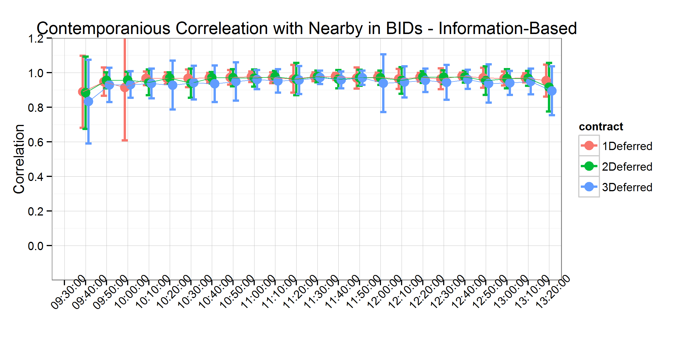

```{r, echo=FALSE}
setwd("C:/Users/mallorym/Documents/GitHub/BBOBAS")
#setwd("C:/Users/mallorym/Documents/BBOBAS")
```


# Introduction
Can we make the citations and biliography work [@hasbrouck2006empirical;@easley2011microstructure]?

# Literature Review

# Conceptual Framework
The role of liquidity trades verses information based trades.

# Data
The data used in this analysis comes from the CME Group's Top of Book (BBO) database for corn futures contracts from 1/4/2010-11/4/2011. The data contains the best bid, bid volume, best offer, offer volume, last trade price, and last trade volume of the order book for each active futures contract, time-stamped to the second. For those familiar with the CME Group's Time & Sales database, the BBO contains the Time & Sales data as well as information about the best bids and offers on the top of the limit order book.  

The data are time-stamped to the second, but trades and updates to the top of the book routinely occur more rapidly than once per second. This results in several updates to the top of the book displaying the same time stamp. This requires us to either aggregate to the second, or to simulate sub-second time stamps (cite Wang and Easley). Since we calculate correlations between updates to the top-of-the book for several contract maturities, simulation would need to preserve (at least) the order in which updates arrived to each respective contract to be useful. Since preserving the order in which updates to the top of the book is impossible, we aggregate to the second instead.   

Further, we exclude days on which there was a limit price move in any of the contracts, since when prices are locked at the limit, calculating correlations is impossible (Dates deleted due to limit price moves are as follows: 1/12/2010, revision to a Crop Production report; 3/31/2011, Prospective Plantings report; 6/30/2011, Planted Acres report; 10/8/2010, World Agricultural Supply and Demand Estimates (WASDE); and 12/9/2010, WASDE). Also, we exclude 4/5/2010, because there was an unusually high number of revisions to the best bid and best offer. Since we were not able to process all of the data for this day in a reasonable amount of computing time, we drop this day from our sample. Additionally, 7/5/2011 was an unusually light trading day after the Fourth of July holiday and resulted in no data for the third to mature contract.

Table 1 shows the first ten entries to our data after manipulating the raw BBO data set from CME Group to display the entire top of the book on one line with the appropriate time stamp. The first column is the time-stamp, the second column is the trade sequence number, which the CME Group gives to individual trades to identify separate orders that arrive on the same second. The third column, SYMBOL, identifies which futures maturity the observation represents. In this case, 1003 stands for March 2010, with the first two characters representing the year and the second two characters representing the month. 

For each date in our sample, we define the first to mature (nearby), one, two, and three contracts deferred. To avoid undesirable delivery month effects, we roll these definitions at the end of the month prior to contract maturity (For example, on March 1st the May futures contract is considered the nearby as opposed to the March futures contract, and so forth). 

# Analysis
Our analysis simply considers the correlation of revisions to nearby contract bids (offers) with one, two, and three deferred contract bids (offers), respectively. The operating assumption here is that when information arrives to the market, it usually will affect the entire forward curve in the same direction. In other words, information that raises the best bid (offer) in the nearby contract, should usually raise the best bid (offer) in the deferred contracts as well. Linkages between the nearby and deferred contracts can be measured with simple correlations without making the distributional assumptions required by a more intricate econometric model. Given the high frequency and irregularly spaced nature of the data, such distributional assumptions are often problematic (cite). 

We have two primary objectives in this study: 1) calculate the strength of correlations between the order books of the nearby and deferred contracts, and 2) measure (or bound) the time it takes for information to be transmitted from nearby to deferred contracts. To measure the first, we calculate contemporaneous correlations between the log changes of the bid (offer) in the nearby and the deferred contracts. Then, to measure the second we calculate the correlation between time lagged log changes of the bid (offer) of the nearby with log changes of the bid of the deferred contracts. We lag the nearby by one second and ten seconds. The time lagged correlations provide a measure of how long it takes for information to be transmitted from nearby to the deferred contracts. The logic is that if we observe contemporaneous correlation between the nearby and deferred contracts, we can search for the time lag at which we observe the correlation disappearing. We conclude that information has been fully transmitted when the time lagged nearby and deferred contract order book revisions become uncorrelated.  

Since the corn futures contract experiences non-uniform trading volume throughout the day, there may be time of day effects in the strength and rate at which information is transmitted through the futures market. To measure how the correlations change throughout the trading day, we divide the day into ten minute intervals and calculate correlations between the nearby and the deferred contract bids (offers) for each interval with one day's worth of data. This allows us to detect if there are any discernible patterns to the correlations over the trading day. Further, since we calculate one correlation per day we also recover a whole distribution of the correlations for each time interval.  

## USDA Announcement Days
On USDA report announcement days there is often a significant amount of information that market participants receive at the same time, causing large price fluctuations and larger than usual trading volumes. Therefore, in our analysis we also separate out days on which major USDA reports are released and calculate the same correlations described above. During our sample period, the USDA reports we include were released at 8:30 am CST, before the day trading session began.

## Treatment of Zero Changes
We mentioned above that it is common to have multiple revisions to the order book happen in the same second (and consequently receive the same time-stamp in the data). The converse is also true, however. There are also many instances where a number of seconds will transpire before a revision to the top of the order book arrives. This results in our variables, log changes in best bid (offer), containing many zeros. How these zeros are distributed between the contracts is related to the concepts of liquidity-based activity verses information-based activity discussed in the conceptual framework above.

To fix ideas consider the case where we intend to calculate the contemporaneous correlation between the nearby and the deferred contracts. There are four possibilities for the presence of zeros. On any time stamp one of four situations may be operative: 1) neither the nearby nor the deferred has a zero log change in the bid (offer), 2) either the nearby or the deferred has a zero log change in the bid (offer), but not both, or 3) both the nearby and the deferred have a zero log change in the bid (offer).    

Based on the definition of liquidity-based activity and information-based activity in the conceptual framework from above, we present a case for interpreting (1) as indicating information-based activity is present, (2) liquidity-based activity is present, and (3) neither liquidity based activity nor information-based activity is present.    

# Results


## Contemporaneous Correlation


## Contemporaneous Correlation on USDA Report Days


## Contemporaneous and Time-lagged Correlations


## Contemporaneous and Time-lagged Correlations on USDA Report Days


## Spread Traders?


# Conclusions

# Tables

|                    |  EX   |SYMBOL|	OFRSIZ|	OFR   |	BIDSIZ|	BID   |
|-------------------:|:-----:|:----:|:-----:|:-----:|:-----:|:-----:|
|	2010-01-04 09:30:00|	98790|	1003|	  1475|	423.75|	  1188|	423.75|
|	2010-01-04 09:30:00|	98800|	1003|	  1483|	423.75|	  1188|	423.75|
|	2010-01-04 09:30:00|	98810|	1003|	  1483|	423.75|	  1197|	423.75|
|	2010-01-04 09:30:00|	98820|	1003|	  1486|	423.75|	  1197|	423.75|
|	2010-01-04 09:30:00|	98830|	1003|	  1486|	423.75|	  1231|	423.75|
|	2010-01-04 09:30:00|  98840|	1003|	  1494|	423.75|	  1231|	423.75|
|	2010-01-04 09:30:00|	98850|	1003|	  1496|	423.75|	  1231|	423.75|
|	2010-01-04 09:30:00|	98860|	1003|	  1510|	423.75|	  1231|	423.75|
|	2010-01-04 09:30:00|	98870|	1003|	  1510|	423.75|	  1233|	423.75|
|	2010-01-04 09:30:00|	98880|	1003|	  1520|	423.75|	  1234|	423.75|

: Table 1: First ten entries in our data set. 

# Figures 





# References
